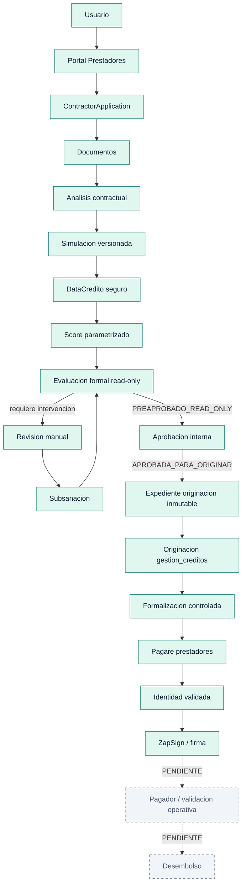
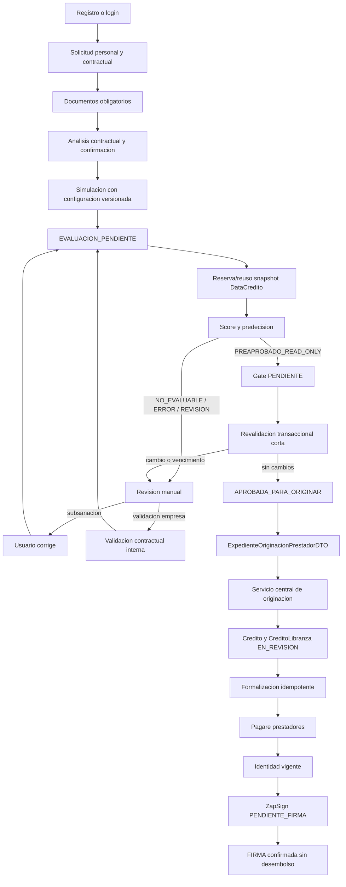
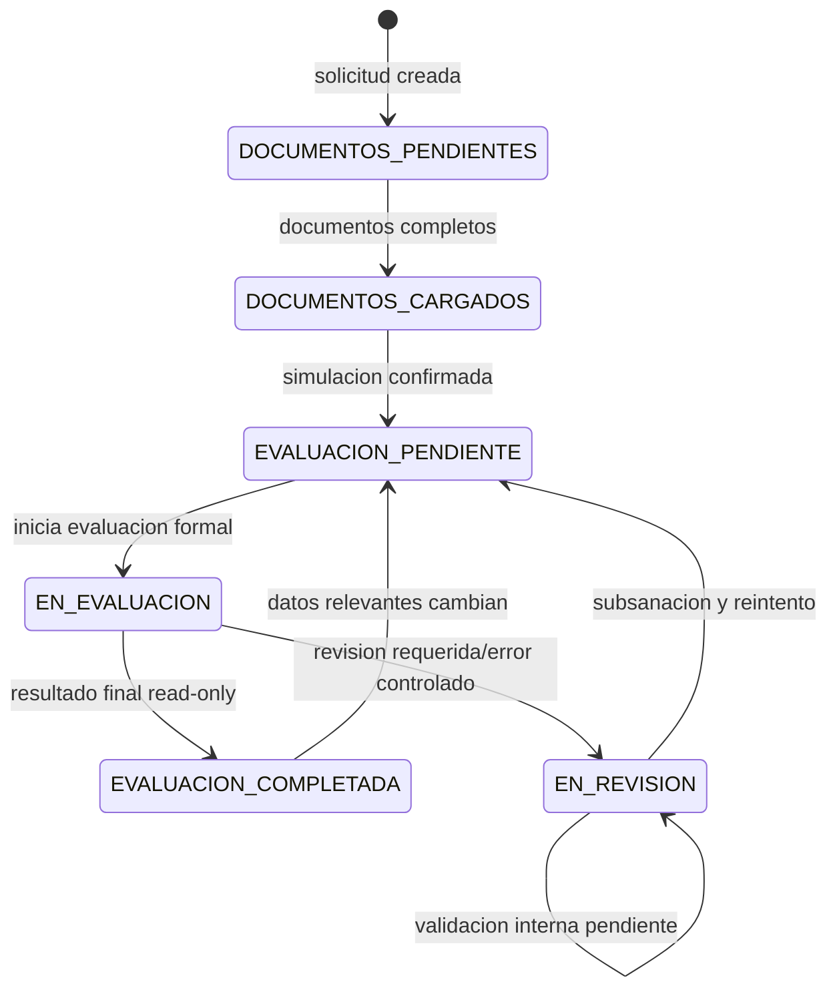
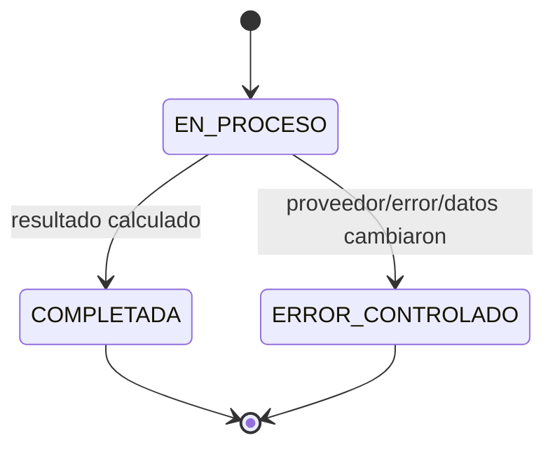
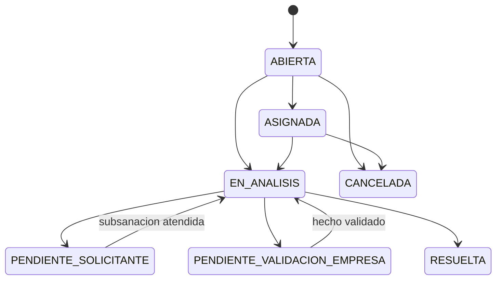
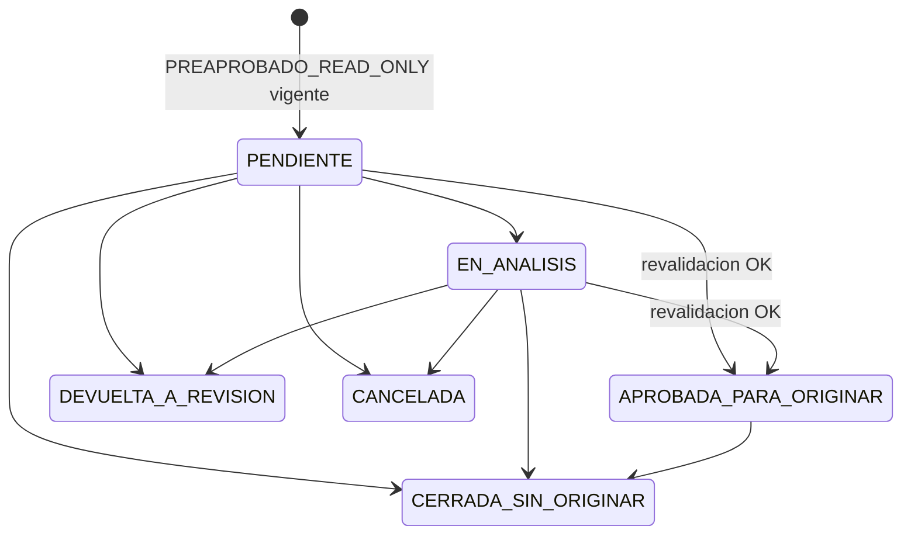
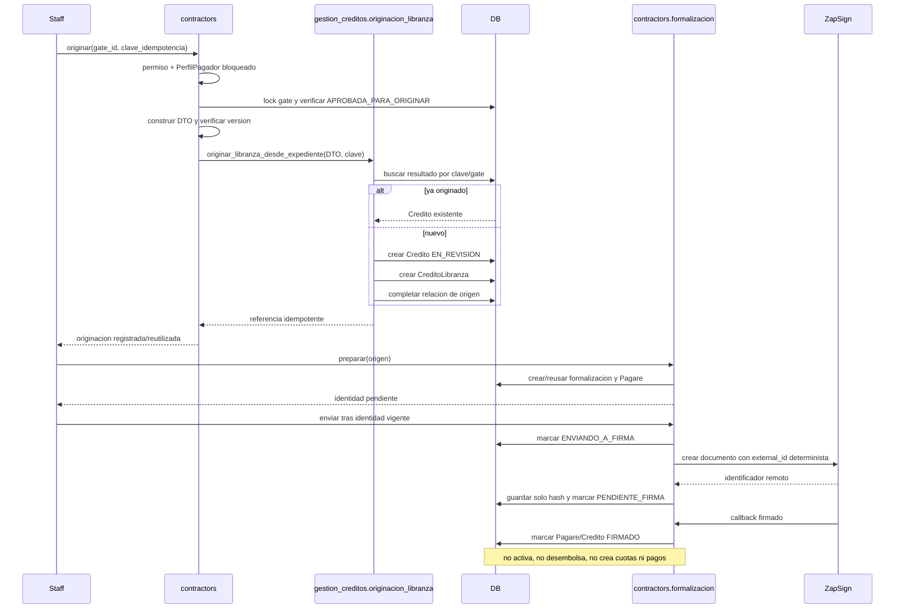
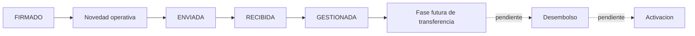

# Flujo end-to-end de Prestadores de Servicios

Estado del documento: **Commit G - formalizacion y firma controlada implementadas**.

Convenciones:

- **IMPLEMENTADO**: existe codigo y pruebas en la rama actual.
- **PARCIAL**: existe una frontera o preparacion, pero no el proceso productivo completo.
- **PENDIENTE**: no debe ejecutarse en la fase actual.

## 1. Objetivo del modulo

El dominio `contractors` recibe y evalua solicitudes de Prestadores de Servicios. Su
responsabilidad publica termina en la solicitud y su evaluacion. La accion staff del
Commit F entrega un expediente inmutable al servicio central de `gestion_creditos`,
que crea una obligacion exclusivamente en estado `EN_REVISION`. Commit G formaliza
esa obligacion, genera un pagare especifico, exige identidad vigente y coordina la
firma sin activar, desembolsar, crear cuotas ni registrar pagos.

El modulo conserva trazabilidad desde la solicitud publica hasta la decision interna,
sin convertir `PREAPROBADO_READ_ONLY` en una aprobacion crediticia o desembolso.

## 2. Principios arquitectonicos

1. `contractors` controla solicitud, documentos, contrato, simulacion, evaluacion,
   revision y gate interno.
2. `integrations` controla el acceso al proveedor DataCredito y sus DTO normalizados.
3. `gestion_creditos` debe ser la unica frontera futura para crear `Credito` y
   `CreditoLibranza` y para ejecutar su ciclo financiero.
4. Las decisiones se versionan; ningun resultado se aplica si los datos cambiaron.
5. Las respuestas externas se guardan solo como snapshots normalizados y sanitizados.
6. Los permisos de pagador no se reutilizan para decisiones internas de riesgo.
7. Pagar, desembolsar, generar pagare y enviar a ZapSign estan fuera del gate.

## 3. Arquitectura general



## 4. Flujo end-to-end



## 5. Maquina de estados ContractorApplication

No se agregan `PENDIENTE_APROBACION_INTERNA` ni `APROBADA_PARA_ORIGINAR` al modelo.
Esos estados se derivan inequívocamente de `AprobacionInternaPrestador`, evitando dos
fuentes de verdad.



| Estado | Lo genera | Siguiente accion valida |
|---|---|---|
| `DOCUMENTOS_PENDIENTES` | solicitud/carga parcial | completar documentos |
| `DOCUMENTOS_CARGADOS` | servicio de solicitud | completar simulacion |
| `EVALUACION_PENDIENTE` | simulacion o invalidacion | evaluacion formal |
| `EN_EVALUACION` | `evaluacion_formal._iniciar_evaluacion` | finalizar evaluacion |
| `EVALUACION_COMPLETADA` | predecision final | gate o cierre operativo |
| `EN_REVISION` (semantica manual) | revision/subsanacion | corregir o reintentar |

## 6. Maquina de estados de evaluacion



Resultados de `PredecisionPrestadorAudit`: `PREAPROBADO_READ_ONLY`,
`REQUIERE_REVISION_MANUAL`, `BLOQUEADO_READ_ONLY`, `NO_EVALUABLE` y
`ERROR_CONTROLADO`. Solo el primero habilita la creacion del gate.

## 7. Maquina de estados de revision manual



La revision es una bandeja interna de Aprobado. `PerfilPagador` queda bloqueado en
vistas y servicios incluso si recibe permisos Django por error.

## 8. Maquina de estados de aprobacion interna



`APROBADA_PARA_ORIGINAR` solo autoriza construir el expediente. No implica credito,
pagare, firma, obligacion activa ni desembolso.

## 9. Modelos

| Modelo | Responsabilidad | Datos sensibles | Fuente de verdad | Relaciones |
|---|---|---|---|---|
| `ContractorApplication` | solicitud y estado operativo | identidad/contacto/contrato | si | usuario, empresa |
| `ContractorApplicationDocument` | archivos obligatorios | cedula, contrato, certificado | si para archivo | solicitud, uploader |
| `ConfiguracionSimuladorPrestador` | limites y tasa de simulacion | no | si financiera preliminar | politica score |
| `ConfiguracionScorePrestador` | pesos, umbrales y versiones | no | si de politica | configuracion financiera, bandas |
| `BandaScorePrestador` | banda, topes y resultado | no | si para banda | politica |
| `PredecisionPrestadorAudit` | snapshot inmutable de evaluacion | snapshot sanitizado | si de una evaluacion | solicitud, usuario |
| `TimelinePrestador` | eventos allowlist | metadata sanitizada | auditoria operativa | solicitud, usuario |
| `RevisionManualPrestador` | caso de analisis humano | comentarios internos | si de revision | solicitud, auditoria |
| `RequerimientoSubsanacionPrestador` | correccion solicitada | mensaje controlado | si de subsanacion | solicitud, revision |
| `AprobacionInternaPrestador` | gate humano previo a originar | comentario interno, topes | si del gate | solicitud, auditoria, revision |
| `AutorizacionConsultaDatacreditoPrestador` | consentimiento versionado | hash y referencia | si de autorizacion | solicitud, usuario |
| `ConsultaDatacreditoSnapshot` | resultado externo reutilizable | hash, resultado normalizado | si del snapshot | referencia logica a solicitud/autorizacion |
| `OrigenCreditoPrestador` | enlace idempotente gate/obligacion | IDs y clave opaca | si del origen | Credito, CreditoLibranza |
| `FormalizacionCreditoPrestador` | control de documento, identidad y firma | hashes y estados; no token/raw | si de formalizacion | origen, Credito, CreditoLibranza, Pagare |
| `SecuenciaNumeroCredito` | consecutivo anual transaccional | no | si de numeracion | ninguna |

## 10. Servicios

| Servicio | Entrada | Salida | Efectos laterales | Transaccion |
|---|---|---|---|---|
| `analisis_contractual_seguro` | PDF/autorizacion | metadata firmada | no conserva PDF temporal | corta al persistir |
| `solicitud` | solicitud/documentos | estado operativo | invalida evaluacion si cambia | si |
| `capacidad_contractual` | contrato/solicitud | capacidad preliminar | ninguno | no |
| `validacion_contractual` | solicitud | estado, meses, bloqueos | ninguno | no |
| `autorizacion_datacredito` | solicitud/consentimiento | autorizacion vigente | persiste autorizacion | si |
| `datacredito_evaluacion` | solicitud/modo | DTO normalizado | reserva/finaliza snapshot y timeline | HTTP fuera; escrituras cortas |
| `predecision` | solicitud/politica/DataCredito | resultado read-only | ninguno | no |
| `evaluacion_formal` | solicitud/actor | auditoria | auditoria, estado, timeline, revisiones | fases cortas; HTTP fuera |
| `revision_manual` | revision/actor/accion | revision/requerimiento | revision, subsanacion, timeline | si |
| `subsanacion` | requerimiento/cambios | requerimiento atendido | invalida evaluacion | si |
| `aprobacion_interna` | auditoria o gate/actor | gate | gate, revision, timeline | si, corta |
| `expediente_originacion` | gate aprobado | DTO inmutable | ninguno | no |
| `originacion_libranza` | DTO + clave + actor | origen, Credito y detalle | crea obligacion EN_REVISION | si, atomica |
| `contractors.services.originacion` | gate aprobado + actor | resultado central | timeline allowlist | si |
| `formalizacion` | origen completado + actor | formalizacion y Pagare | estados/timeline; sin efectos financieros | fases atomicas cortas |
| `pagare_service.generar_pagare_prestador_pdf` | formalizacion versionada | Pagare/PDF | archivo privado y hash | escritura corta |
| `zapsign_client.crear_documento` | PDF temporal + firmante | identificador remoto | HTTP fuera de transaccion larga | no |
| `procesar_callback_formalizacion_prestador` | hash documento + evento | estado firma | firma/timeline; no desembolsa | si, corta |

## 11. Rutas

El host de Prestadores usa `aprobado_web.urls_contractors`. El login y registro reales
son los de django-allauth bajo `/accounts/`; no existen aliases `/login/` o `/registro/`.

| Metodo | URL | Vista | Autenticacion | Permiso | Responsabilidad |
|---|---|---|---|---|---|
| GET | `/` | `inicio_prestadores_view` | publica | - | redirigir/iniciar portal |
| GET/POST | `/accounts/login/` | allauth `account_login` | publica | - | login |
| GET/POST | `/accounts/signup/` | allauth `account_signup` | publica | - | registro |
| GET/POST | `/solicitar/` | `solicitar_prestador_view` | login | ownership | wizard |
| POST | `/contrato/analizar/` | `analizar_contrato_prestador_view` | login + CSRF | ownership temporal | analisis inicial |
| GET/POST | `/solicitud/<id>/documentos/` | `documentos_prestador_view` | login | ownership | documentos |
| POST | `/solicitud/<id>/contrato/analizar/` | `analizar_contrato_prestador_view` | login + CSRF | ownership | analisis contractual |
| GET | `/solicitud/<id>/documentos/<doc>/descargar/` | `descargar_documento_prestador_view` | login | ownership | descarga protegida |
| GET | `/simular/` | `simular_prestador_view` | login | ownership | simulador |
| POST | `/simular/calcular/` | `calcular_simulacion_prestador_view` | login + CSRF | ownership | registrar simulacion |
| GET | `/mi-credito/` | `mi_credito_prestador_view` | login | ownership | estado publico allowlist |
| GET/POST | `/mi-credito/solicitud/<id>/subsanacion/<req>/` | `atender_subsanacion_prestador_view` | login | ownership | corregir requerimiento |
| GET | `/gestion/prestadores/` | `bandeja_prestadores_view` | staff | `can_view_contractor_review_queue` | bandeja interna |
| GET | `/gestion/prestadores/<id>/` | `detalle_prestador_view` | staff | permiso de bandeja | detalle/revision/gate |
| POST | `/gestion/prestadores/<id>/aprobacion-interna/crear/` | `crear_aprobacion_interna_prestador_view` | staff + CSRF | `can_decide_contractor_internal_approval` | crear gate |
| POST | `/gestion/prestadores/aprobaciones/<gate>/accion/` | `accion_aprobacion_interna_prestador_view` | staff + CSRF | permiso segun accion | decidir gate |
| POST | `/gestion/prestadores/aprobaciones/<gate>/originar/` | `originar_credito_prestador_view` | staff + CSRF | `can_originate_contractor_credit` | originar EN_REVISION |
| POST | `/gestion/prestadores/origenes/<origen>/formalizar/` | `preparar_formalizacion_prestador_view` | staff + CSRF | `can_prepare_contractor_formalization` | generar/reusar Pagare |
| POST | `/gestion/prestadores/formalizaciones/<id>/enviar-firma/` | `enviar_formalizacion_prestador_firma_view` | staff + CSRF | `can_retry_contractor_signature` | enviar/reconciliar firma |
| POST | `/gestion/prestadores/revisiones/<revision>/accion/` | `accion_revision_prestador_view` | staff + CSRF | permiso segun accion | operar revision |
| GET | `/gestion/prestadores/documentos/<doc>/descargar/` | `descargar_documento_prestador_staff_view` | staff | permiso de bandeja | descarga interna |

## 12. Seguridad

- Las vistas publicas filtran por `usuario=request.user` y ocultan existencia ajena.
- Las acciones mutables son POST y usan middleware CSRF de Django.
- Las descargas validan ownership o permiso staff; no se publican URLs directas.
- Los servicios internos exigen `is_staff`, permiso especifico y ausencia de
  `perfil_pagador`.
- El documento se enmascara y se usa HMAC para fingerprint/versionado.
- El versionado de datos personales y actividad usa HMAC; no los copia al snapshot.
- Timeline y auditorias usan metadata allowlist; no guardan PDF, contrato raw, token,
  credencial ni respuesta raw de DataCredito.
- Formalizacion conserva unicamente SHA-256 del identificador ZapSign y HMAC de la
  referencia de identidad; no persiste OTP, URL de firma, token, payload ni biometria.
- El callback de Prestadores guarda un resumen allowlist en `ZapSignWebhookLog`; el
  flujo tradicional conserva su contrato existente sin ser reemplazado.
- El gate aplica `select_for_update` a solicitud/auditoria/gate y constraints unicas.

## 13. DataCredito

**IMPLEMENTADO** mediante `contractors.services.datacredito_evaluacion` y
`contractors.datacredito.adapter` sobre clientes de `integrations.datacredito`.

La consulta exige autorizacion vigente. Un fingerprint HMAC combina documento,
servicio, ambiente, version de autorizacion y parametros relevantes. Por defecto se
reutiliza un snapshot `EXITOSO` vigente. `FORZAR_CONSULTA` exige staff, permiso y
justificacion; `SOLO_CACHE` nunca consulta proveedor.

La reserva `EN_PROCESO` y la restriccion parcial unica evitan consultas concurrentes
equivalentes. Timeout, proveedor deshabilitado, configuracion incompleta y error del
proveedor producen resultados controlados. No se almacena raw, XML/JSON completo,
token, headers, secreto ni documento plano.

## 14. Score

**IMPLEMENTADO** en `contractors.score`. La politica parametriza componentes, pesos,
bandas, umbrales y topes. Identidad, contrato, documentos, capacidad, autorizacion,
snapshot y configuracion financiera son componentes obligatorios para un resultado
favorable. DataCredito aporta score/señales normalizadas; no se acopla al motor.

Referencias no son obligatorias en V1 (`requiere_referencias=False`) y no reciben
puntaje inventado. La redistribucion solo ocurre si la politica la permite.
Geolocalizacion no puntua ni penaliza sin señal verificable. Antifraude se limita a
coherencia de identidad y datos disponibles.

## 15. Contrato

**IMPLEMENTADO** en `validacion_contractual`.

Estados: `VIGENTE`, `VENCIDO`, `SUSPENDIDO`, `TERMINADO`, `LIQUIDADO` y
`NO_DETERMINABLE`. Solo `VIGENTE` habilita capacidad automatica. La identidad debe
coincidir, la empresa seleccionada debe tener convenio activo y la obligacion a favor
del prestador debe ser positiva y coherente.

Se usa fecha final explicita o fecha inicial mas duracion contractual con meses
calendario. Los meses financiables son meses completos; menos de uno produce cero.
Reemplazar contrato cambia su hash, invalida version/evaluacion/gate y obliga a una
nueva evaluacion.

## 16. Simulacion y politica

**IMPLEMENTADO** con relacion explicita:

```text
ConfiguracionScorePrestador
        |
        +--> ConfiguracionSimuladorPrestador
```

La solicitud conserva versiones de politica/configuracion, tasa, monto maximo, plazo
maximo, monto/plazo simulados y fecha. La evaluacion compara ese snapshot con la
politica activa. Una politica posterior, version ausente o edicion manual genera
revision; nunca se cambian valores silenciosamente.

## 17. Revision manual y subsanacion

**IMPLEMENTADO**. La evaluacion crea/reutiliza revisiones por solicitud y motivo.
El analista puede asignar, iniciar, solicitar correccion allowlist, solicitar
validacion contractual de empresa, resolver, cancelar o reintentar. El solicitante
solo ve mensajes publicos allowlist y atiende requerimientos propios.

La empresa confirma hechos contractuales; no toma la decision crediticia y no se usa
la doble aprobacion de Libranza tradicional.

## 18. Aprobacion interna

**IMPLEMENTADO** en `AprobacionInternaPrestador` y
`contractors.services.aprobacion_interna`.

La creacion exige la ultima auditoria completada con `PREAPROBADO_READ_ONLY`, datos y
documentos vigentes, ausencia de revision/subsanacion, contrato con capacidad,
politica/configuracion/simulacion compatibles, autorizacion y snapshot vigentes. Dos
constraints garantizan un gate por auditoria y un gate activo por solicitud.

Antes de aprobar se repite toda validacion dentro de una transaccion corta. Un cambio
devuelve el gate a revision con motivo allowlist. El analista puede reducir monto o
plazo, nunca aumentarlos. Se conservan topes originales y valores autorizados.

## 19. Frontera de originacion

`contractors` termina en `ExpedienteOriginacionPrestadorDTO`, dataclass inmutable
construida solo desde un gate `APROBADA_PARA_ORIGINAR` y con version intacta. La
vista no escribe modelos financieros. `contractors.services.originacion` bloquea el
gate, reconstruye el DTO y delega en
`gestion_creditos.services.originacion_libranza.originar_libranza_desde_expediente`.

El servicio central usa `transaction.atomic`, `OrigenCreditoPrestador.gate_id` unico y
`clave_idempotencia` unica (`prestador:<gate_id>:<version_datos>`). Un reintento con la
misma clave devuelve el mismo `Credito` y `CreditoLibranza`; una clave diferente para
el mismo gate se rechaza.

## 20. Mapping de originacion implementado

| Expediente Prestador | Destino | Regla |
|---|---|---|
| `usuario_id` | `Credito.usuario_id` | usuario propietario |
| monto/plazo solicitados | `Credito.monto_solicitado/plazo_solicitado` | snapshot del gate |
| monto/plazo autorizados | `Credito.monto_aprobado/plazo` | limites humanos, estado EN_REVISION |
| `tasa_mensual` | `Credito.tasa_interes` | snapshot financiero |
| identidad/contacto | `CreditoLibranza` | copia estructurada del expediente |
| `empresa_id` | `CreditoLibranza.empresa_id` | Empresa existente |
| cargo/tipo/fechas/valores | campos contractuales de `CreditoLibranza` | sin datos laborales ficticios |
| contrato | `contrato_prestacion_servicios` | referencia al archivo existente |
| cedulas/certificado bancario | campos documentales existentes | referencia al archivo existente |
| escenario | `CreditoLibranza.escenario_credito` | valor compartido de libranza |

`certificado_laboral` e `ingresos_mensuales` quedan vacios: el contrato de prestacion
no se disfraza como relacion laboral. Los archivos no se duplican fisicamente.

## 21. Secuencia de originacion y formalizacion



## 22. Numeracion y efectos laterales

`Credito.save()` reserva ahora el consecutivo anual mediante `SecuenciaNumeroCredito`
y `select_for_update`. La primera reserva inicializa el contador con el maximo numerico
historico del año. La reserva puede dejar saltos si una transaccion posterior falla,
pero no reutiliza ni duplica numeros. La restriccion `Credito.numero_credito unique`
permanece como defensa adicional.

La originacion no llama `gestionar_cambio_estado_credito`, preparacion de pagare,
ZapSign, activacion, desembolso, pagos, pagador ni generacion de amortizacion. Tampoco
crea `HistorialEstado`: la trazabilidad de esta fase queda en `OrigenCreditoPrestador`
y `TimelinePrestador` (`ORIGINACION_INICIADA`, `COMPLETADA`, `REUTILIZADA` o
`ERROR_CONTROLADO`).

## 23. Auditoria y formalizacion Commit G

### Auditoria del flujo existente

- `Pagare` es un `OneToOne` de `Credito` y ya almacena PDF, hash, version y estados.
- `pagare_service` usa HTML + WeasyPrint y ya centraliza numeracion, render y hash.
- Las plantillas tradicionales `pagare_v1.0.html` y `pagare_v2.0.html` contienen
  semantica laboral/desembolso que no se reutiliza para Prestadores.
- `zapsign_client.ZapSignClient` es el cliente HTTP existente. Se extendio con
  `external_id` y validacion obligatoria de identidad sin duplicar cliente.
- El flujo tradicional `preparar_documento_para_firma` genera, cambia estado y agenda
  el envio con `transaction.on_commit`; permanece intacto.
- El webhook tradicional marca `FIRMADO` y llama expresamente al desembolso. Esa rama
  no es segura para Prestadores y no se reutiliza para sus documentos.
- No existe un OTP interno reusable. La validacion disponible en firma es la
  verificacion de identidad/selfie de ZapSign. Por eso se implemento una frontera que
  registra una validacion ya confirmada por proveedor, ligada al titular y con expiry.
- No se encontraron senales `post_save` que desembolsen por guardar `FIRMADO`; el
  efecto financiero tradicional es una llamada explicita del webhook legado.

### Decisiones implementadas

- `FormalizacionCreditoPrestador` separa originacion, documento, identidad y firma.
- La clave `prestador:<credito_id>:formalizacion:<version>` y relaciones `OneToOne`
  impiden dos formalizaciones o pagares para el mismo origen.
- El template `pagares/pagare_prestadores_v1.0.html` usa honorarios y contrato de
  prestacion; no inventa certificado laboral ni afirma un desembolso previo.
- El PDF se construye desde snapshots ya originados y se bloquea si monto, plazo,
  tasa, gate o version dejaron de coincidir.
- La identidad debe pertenecer al usuario del credito y estar vigente. Solo se guarda
  HMAC de la referencia externa.
- El envio usa transacciones cortas. La llamada ZapSign ocurre fuera del bloque y
  fuerza validacion de identidad. Solo se guarda SHA-256 del identificador remoto.
- Si ya existe hash remoto, el reintento concilia estados sin otro POST. Un estado
  `ENVIANDO_A_FIRMA` sin identificador se considera resultado incierto y bloquea un
  reenvio automatico para evitar documentos duplicados.
- El callback reconoce el documento por hash, es idempotente y solo actualiza firma,
  historial y timeline. Nunca llama activacion o desembolso.
- `PerfilPagador` queda bloqueado en vistas y servicio; no se crea
  `AprobacionPagadorLibranza` ni se usa doble aprobacion tradicional.

### Estados y timeline

```text
EN_REVISION
  -> PENDIENTE_VALIDACION_IDENTIDAD
  -> IDENTIDAD_VALIDADA
  -> ENVIANDO_A_FIRMA
  -> PENDIENTE_FIRMA
  -> FIRMADO (validaciones post-firma pendientes)
```

Eventos allowlist: `FORMALIZACION_INICIADA`, `PAGARE_GENERADO`,
`IDENTIDAD_VALIDADA_FIRMA`, `ENVIO_FIRMA_INICIADO`, `PENDIENTE_FIRMA`,
`FIRMA_CONFIRMADA`, `FIRMA_ERROR_CONTROLADO` y `FORMALIZACION_REUTILIZADA`.

### Pendientes posteriores

- Aprobar juridicamente el texto especifico del pagare antes de habilitar produccion.
- Conectar la frontera de identidad al callback productivo del proveedor; staff no
  puede simularla desde la UI.
- Validar en sandbox que ZapSign respeta `external_id` y la configuracion de selfie.
- Definir recuperacion privada del PDF firmado sin persistir URL publica.
- Activacion, amortizacion, desembolso, pagos y recaudos en una fase posterior.
- Prueba de concurrencia real en PostgreSQL para complementar constraints y locks.
- Resolver por separado la deuda de migraciones `WhatsAppInternal*`; Commit G no la
  incluye.

## 24. Historial de commits/fases

| Fase | Estado | Alcance |
|---|---|---|
| A | IMPLEMENTADO | auditoria y versionado de evaluacion |
| B | IMPLEMENTADO | DataCredito seguro, snapshots e idempotencia |
| C | IMPLEMENTADO | score parametrizado y predecision formal read-only |
| D | IMPLEMENTADO | revision manual, subsanacion y bandeja interna |
| E | IMPLEMENTADO | gate interno y expediente inmutable |
| F | IMPLEMENTADO | servicio central idempotente y Credito EN_REVISION |
| G | IMPLEMENTADO | formalizacion, pagare, identidad y firma sin efectos financieros |
| H | IMPLEMENTADO | novedad operativa post-firma con empresa/pagador, sin decision crediticia |

## 25. Operacion post-firma Commit H

### Auditoria y decision de estado

- `Notificacion` es una alerta generica por usuario y no conserva idempotencia,
  recepcion, gestion ni relaciones completas con formalizacion y empresa. No se usa
  como fuente de verdad para esta etapa.
- Los correos existentes a pagadores usan `PerfilPagador`, `Empresa` y la
  infraestructura SMTP de Django. Se reutiliza ese canal, no la logica de decision.
- `PENDIENTE_TRANSFERENCIA` habilita vistas y servicios administrativos de
  transferencia. Para evitar efectos financieros, el credito permanece `FIRMADO`.
- La novedad `GESTIONADA` es la unica senal de que termino la operacion empresarial;
  no cambia el estado financiero ni ejecuta transferencia.

### Modelo, DTO e idempotencia

`NovedadOperativaPrestador` enlaza mediante relaciones protegidas y unicas la
formalizacion, `Credito`, `CreditoLibranza` y `Empresa`. La clave determinista
`prestador:<credito_id>:novedad-operativa:<formalizacion_id>` evita duplicados.

Estados:

```text
PENDIENTE_ENVIO -> ENVIANDO -> ENVIADA -> RECIBIDA -> GESTIONADA
                              \-> ERROR_CONTROLADO -> reintento controlado
```

El DTO contiene solo identificadores operativos, nombre, documento enmascarado,
monto/plazo formalizados, fecha de firma y fechas contractuales. No incluye score,
DataCredito, fraude, comentarios internos, tokens ni payloads externos.

### Destinatarios, envio y recepcion

- Los destinatarios son usuarios activos con `PerfilPagador.es_pagador=True` de la
  misma empresa y correo configurado. Nunca se usa el correo libre del solicitante.
- La transaccion corta marca `ENVIANDO` e incrementa el intento. El correo se envia
  fuera del bloque y otra transaccion registra `ENVIADA` o `ERROR_CONTROLADO`.
- Solo se persisten HMAC del correo y una version enmascarada de cada destinatario.
- Un pagador autenticado, de la empresa correcta y con permiso explicito puede
  confirmar recepcion y luego marcar la novedad como gestionada. Ambas acciones son
  POST, CSRF e idempotentes.
- El pagador no puede originar, formalizar, cambiar condiciones, decidir credito,
  activar, desembolsar ni ejecutar transferencias desde este flujo.

### Rutas y permisos

Staff:

- `POST /gestion/prestadores/formalizaciones/<id>/novedad-operativa/`
- `POST /gestion/prestadores/novedades/<id>/enviar/`
- `can_create_contractor_operational_notice`
- `can_retry_contractor_operational_notice`
- `can_view_contractor_operational_notice`

Pagador:

- `GET /pagador/prestadores/novedades/`
- `GET /pagador/prestadores/novedades/<id>/`
- `POST /pagador/prestadores/novedades/<id>/confirmar-recepcion/`
- `POST /pagador/prestadores/novedades/<id>/marcar-gestionada/`
- `can_view_contractor_operational_notice`
- `can_acknowledge_contractor_operational_notice`

No se usan `AprobacionPagadorLibranza`, niveles, doble aprobacion ni helpers de
decision de libranza tradicional.

### Timeline y secuencia

Eventos allowlist: `NOVEDAD_OPERATIVA_GENERADA`,
`NOVEDAD_OPERATIVA_ENVIO_INICIADO`, `NOVEDAD_OPERATIVA_ENVIADA`,
`NOVEDAD_OPERATIVA_RECIBIDA`, `NOVEDAD_OPERATIVA_GESTIONADA`,
`NOVEDAD_OPERATIVA_ERROR` y `NOVEDAD_OPERATIVA_REENVIO`. La metadata se limita a
IDs, canal, actor y estado.



Commit H no crea cuotas, pagos, recaudos ni aprobaciones del pagador. Transferencia,
desembolso y activacion permanecen pendientes para una fase posterior y explicita.

## 26. Checkpoint funcional pre-Commit I

### Punto de entrada operativo

Las solicitudes en `EVALUACION_PENDIENTE` y las ejecuciones recuperables visibles en
`EN_EVALUACION` aparecen al inicio de `/gestion/prestadores/`. La sección muestra
identificación enmascarada, empresa, monto/plazo, análisis contractual, progreso
documental y acceso al detalle. Una solicitud existente, incluida la solicitud local
`#5`, aparece por su estado sin correcciones manuales ni datos artificiales.

El detalle presenta autorización DataCrédito vigente, estado de ejecución, última
predecisión y score únicamente para usuarios con el permiso reservado. El botón
`Ejecutar evaluación` solo aparece para `EVALUACION_PENDIENTE` y llama mediante POST
a:

```text
/gestion/prestadores/solicitudes/<id>/evaluar/
```

La ruta exige staff y `can_evaluate_contractor_application`, usa CSRF y bloquea
`PerfilPagador` tanto en la vista como en `evaluar_solicitud_prestador`.

### Servicio, idempotencia y colas de resultado

La vista no contiene lógica de proveedor ni score. Reutiliza
`evaluar_solicitud_prestador`, que bloquea la solicitud, calcula versión y clave de
idempotencia, reutiliza snapshots DataCrédito vigentes y evita otra auditoría para la
misma combinación de datos, política y configuración. La consulta externa permanece
fuera de transacciones largas.

```text
EVALUACION_PENDIENTE
  -> EN_EVALUACION
  -> PREAPROBADO_READ_ONLY      -> Preaprobados pendientes
  -> REQUIERE_REVISION_MANUAL   -> Revisiones manuales
  -> BLOQUEADO_READ_ONLY        -> Resultado final en detalle
  -> NO_EVALUABLE / ERROR       -> Revisión o error controlado
```

Este checkpoint no crea `Credito`, `CreditoLibranza` ni
`AprobacionPagadorLibranza`; tampoco origina, activa o desembolsa. La bandeja sigue
siendo backoffice interno y posteriormente deberá integrarse al backoffice unificado
sin depender del subdominio de Prestadores.

### Pendientes UX registrados

- La parametrizacion financiera del simulador se resuelve en el Fix 2 descrito en
  la seccion siguiente; ya no existe fallback silencioso a 24 meses.
- La vista documental requiere un rediseño posterior.
- El botón público `Ver estado` es redundante y debe revisarse por separado.
- El mapa y la geolocalización permanecen pendientes.

Estos pendientes no se resuelven en este checkpoint.

## 27. Parametrizacion financiera y politica DEMO (Fix 2)

### Fuente unica y comportamiento sin configuracion

`ConfiguracionSimuladorPrestador` es la fuente persistida de monto, plazo, tasa y
costos del simulador. `ConfiguracionScorePrestador` referencia explicitamente esa
configuracion financiera y `BandaScorePrestador` permanece como inline del Admin.
No se construyen objetos transitorios ni se consultan settings como respaldo.

Si no existe configuracion financiera activa, `/simular/` muestra un estado
controlado, no renderiza controles financieros y el endpoint de calculo responde
`503` sin registrar monto, plazo o snapshot. Si falta la politica score, la
evaluacion formal conserva `NO_EVALUABLE` y `politica_no_configurada`; no se crea
una politica implicita.

Las restricciones administrativas y de modelo exigen:

- una sola configuracion financiera activa y versionada;
- una sola politica score activa;
- pesos iguales a `1.00000`;
- monto y plazo de politica no superiores a la configuracion financiera;
- tasa de referencia igual a la tasa financiera;
- cinco bandas sin solapamientos ni vacios, dentro de los limites de la politica;
- inmutabilidad semantica de configuraciones y bandas usadas por auditorias.

Los historicos inactivos se conservan. Una nueva semantica exige una nueva version.

### Bootstrap LOCAL/DEMO

El bootstrap es manual e idempotente; no es una migracion de datos ni se ejecuta al
desplegar:

```text
python manage.py configurar_politica_prestadores_demo
```

Crea o reutiliza `prestadores-demo-v1` y `prestadores-score-demo-v1`. Aborta si
encuentra otra configuracion o politica activa, y nunca modifica silenciosamente una
version existente con valores diferentes.

Valores financieros DEMO:

| Parametro | Valor |
|---|---:|
| monto minimo | 1.000.000 |
| monto maximo | 10.000.000 |
| plazo | 3 a 8 meses |
| tasa mensual | 2,2000% |
| originacion | 10% |
| IVA originacion | 19% |
| fondo garantia | 2% |
| seguro primera cuota | 0,3711% |

La tasa historica `1,9000%` provenia del default original del simulador y de sus
fallbacks. La evidencia versionada de score, aprobacion interna y originacion usa
`2,2000%`; por eso el comando la declara mediante `TASA_MENSUAL_DEMO`. Esta decision
solo alinea el entorno DEMO y no constituye una politica productiva aprobada.

Pesos DEMO: DataCredito `0,45`, capacidad `0,30`, comportamiento `0,08`, riesgo
`0,12` y referencias `0,05`. Las referencias no son obligatorias y la politica DEMO
permite redistribuir componentes faltantes. Umbrales: Premium `850`, Alta `750`,
Media `680` y Entrada `600`.

Bandas DEMO:

| Banda | Rango | Monto maximo | Plazo maximo | Resultado |
|---|---:|---:|---:|---|
| Revision | 0-599 | 0 | 0 | revision manual |
| Entrada | 600-679 | 3.000.000 | 4 | preaprobado read-only |
| Media | 680-749 | 5.000.000 | 6 | preaprobado read-only |
| Alta | 750-849 | 8.000.000 | 8 | preaprobado read-only |
| Premium | 850-1000 | 10.000.000 | 8 | preaprobado read-only |

### Auditoria y reevaluacion

La auditoria local `#1` de la solicitud `#5` conserva su resultado
`NO_EVALUABLE`, version `politica_no_configurada` y configuracion financiera vacia.
No se reescribe ni elimina. Al instalar una politica y usar el servicio formal de
reintento, la version de politica cambia la clave de idempotencia y permite crear una
nueva `PredecisionPrestadorAudit`, dejando intacta la anterior.

Este Fix no consulta DataCredito real, no crea `Credito` o `CreditoLibranza`, no
origina, no desembolsa y no activa obligaciones.

## 28. Proxy local opcional para DataCredito (Fix 3)

La salida HTTP de OAuth, MiDecisor, HDCPlus y revocacion usa una misma
`requests.Session`. Por defecto la sesion es directa. Para una prueba LOCAL/DEMO
controlada puede configurarse un proxy SOCKS sin modificar los interruptores de
consumo:

```text
DATACREDITO_PROXY_URL=socks5h://127.0.0.1:1080
```

El tunel local puede abrirse por separado:

```text
ssh -N -D 127.0.0.1:1080 usuario@servidor
```

El esquema `socks5h` resuelve DNS a traves del proxy. Requiere instalar las
dependencias del proyecto, que incluyen `PySocks`:

```text
python -m pip install -r requirements.txt
```

La URL del proxy no se registra ni se persiste en snapshots; los logs solo indican
si existe configuracion. La verificacion TLS de `requests` permanece activa. Esta
opcion esta destinada a ejecuciones locales/DEMO; produccion normalmente debe usar
conexion directa dejando `DATACREDITO_PROXY_URL` vacia.

## 29. Evaluacion dual MiDecisor + HDCPlus DEMO V2

La politica DEMO incorpora dos fuentes con responsabilidades distintas. MiDecisor
aporta score externo y señales normalizadas. HDCPlus aporta principalmente la cuota
mensual existente y conserva obligaciones, saldos, mora e historial como insumos
analiticos. Tarjetas, obligaciones, mora, reportes, embargos, saldo total o consultas
recientes no son reglas duras ni deciden por si solos.

Cada fuente conserva un `ConsultaDatacreditoSnapshot` independiente. El fingerprint
incluye ambiente, servicio, hash del documento, autorizacion y, para HDCPlus,
producto, tipo de cuenta y parametros. La evaluacion formal reutiliza cada snapshot
vigente por separado y audita ambos identificadores; nunca persiste raw, token,
credenciales, documento completo ni datos de terceros.

La capacidad usa una unica formula de dominio:

```text
relacion_cuota_ingreso = (cuota_existente_hdc + cuota_nueva) / ingreso_contractual
```

El saldo total HDC no se usa como cuota. Este checkpoint no implementa recogida ni
consolidacion de cartera.

### Politica de fuentes y fallos parciales

| MiDecisor | HDCPlus | Disponibilidad tecnica |
|---|---|---|
| exitoso | exitoso | evaluacion completa |
| exitoso | sin informacion | revision o parcial segun politica |
| exitoso | error transitorio | revision manual; no preaprueba |
| exitoso | error permanente | no evaluable segun politica |
| error | exitoso | no preaprueba sin permiso explicito de politica |
| sin informacion | sin informacion | no evaluable |
| error | error | error controlado/no evaluable |

El cuadro describe disponibilidad de fuentes, no una decision crediticia. Las señales
normalizadas solo alimentan componentes configurables del score propio. Una
contradiccion tecnica se registra como alerta y solo exige revision cuando afecta un
dato critico efectivamente utilizado. La politica DEMO no es productiva y no se activa
automaticamente.

Bootstrap idempotente:

```text
python manage.py configurar_politica_prestadores_demo_v2
```

El comando siempre deja la politica inactiva; la activacion requiere control
administrativo separado. Si V2 existe, esta inactiva y no tiene auditorias, corrige su
parametrizacion de forma idempotente. Si V2 ya fue auditada, conserva su semantica y
crea V3. Los pesos documentados son MiDecisor 45%, HDCPlus 0%, capacidad 30%,
comportamiento digital 8%, consistencia/riesgo 12% y referencias 5%.

HDCPlus sigue siendo obligatorio aunque su peso sea cero: su cuota mensual alimenta
capacidad. No produce un score 0-1000 sintetico por mora, obligaciones, ausencia de
mora o consultas. Referencias no son obligatorias y su peso solo se redistribuye
porque la politica lo declara. La auditoria conserva peso configurado, peso aplicado,
aporte ponderado, componentes faltantes y motivo de redistribucion.

### Prueba HDCPlus UAT controlada

El comando no consume sin confirmacion y solo permite ambiente UAT:

```text
python manage.py probar_hdc_prestador --solicitud-id 7
python manage.py probar_hdc_prestador --solicitud-id 7 --solo-cache
python manage.py probar_hdc_prestador --solicitud-id 7 --confirmar-consumo-real
```

Para local puede usarse `DATACREDITO_PROXY_URL=socks5h://127.0.0.1:1080`. En el VPS
se deja vacio para salida directa por IP fija. La salida contiene solo estado, HTTP,
codigo funcional, snapshot y campos normalizados allowlist. La prueba manual debe
habilitar temporalmente consumo real, verificar OAuth/configuracion, ejecutar el
comando una vez, repetirlo para confirmar reutilizacion y volver a apagar el consumo.

El backoffice muestra el resumen dual solo a staff con permiso de detalle de score.
El portal cliente no expone score, obligaciones, centrales ni razones internas.

## 30. Regla mensual, decision propia y aprobacion de empresa

### Contrato e ingreso mensual

La IA propone `forma_pago`, `frecuencia_pago`, evidencia, confianza y fuente. La regla
de elegibilidad se aplica en backend:

- `MENSUAL`: puede continuar si las demas validaciones contractuales son concluyentes.
- `NO_IDENTIFICADA`: requiere revision contractual.
- otra frecuencia explicita: bloqueo contractual objetivo para este producto.

El ingreso contractual tiene una sola fuente de verdad en
`contractors.services.ingreso_contractual`:

1. usa el valor mensual explicito cuando existe evidencia suficiente;
2. en su ausencia, usa `saldo_pendiente / meses_completos_restantes`;
3. nunca asume que el saldo pendiente equivale al valor total sin evidencia de pagos;
4. si ambos metodos difieren mas que la tolerancia versionada, exige revision;
5. no suma el ingreso explicito y el derivado.

La auditoria conserva metodo, version, ingreso mensual resultante, meses restantes,
valor total y saldo disponible. Menos de un mes completo no produce capacidad.

### Capacidad y score

La capacidad financiera se calcula una sola vez:

```text
carga_total_mensual = cuota_mensual_hdc + cuota_nueva_estimada
relacion_carga_ingreso = carga_total_mensual / ingreso_contractual_mensual
capacidad_disponible =
    ingreso_contractual_mensual * cuota_ingreso_maxima
    - cuota_mensual_hdc
    - otros_compromisos_conocidos
```

El saldo total y el saldo en mora de HDCPlus no se usan como cuota. La cuota HDC no se
descuenta dos veces. MiDecisor aporta el score crediticio externo con peso 45%;
capacidad aporta 30%, comportamiento digital 8%, consistencia/riesgo 12% y referencias
5%. HDCPlus no agrega un termino ponderado independiente, pero sigue siendo obligatorio
para calcular capacidad. El score propio de Aprobado determina si el resultado es
`PREAPROBADO_READ_ONLY`, `REQUIERE_REVISION_MANUAL`, `NO_APROBADO_READ_ONLY` o
`NO_EVALUABLE`.

### Aprobaciones y formalizacion

Una preaprobacion financiera no origina ni habilita firma. El orden obligatorio es:

```text
evaluacion financiera favorable
-> aprobacion interna Aprobado
-> PENDIENTE_APROBACION_PAGADOR
-> confirmacion contractual y operativa de la empresa
-> APROBADO_POR_PAGADOR
-> originacion idempotente EN_REVISION
-> formalizacion
-> validacion de identidad
-> PENDIENTE_FIRMA
```

`AprobacionPagadorPrestador` es independiente de la doble aprobacion de Libranza. El
pagador solo ve contrato, forma de pago, valores, monto y plazo autorizados. No recibe
score, HDC, MiDecisor ni reglas internas. Confirma vinculo, vigencia, pago mensual,
valores contractuales, capacidad operativa y gestion del pago. Una decision rechazada,
pendiente, ajustada, invalidada o correspondiente a otra version impide originacion y
formalizacion.

La novedad operativa posterior a firma sigue siendo un evento distinto: informa una
formalizacion ya realizada y no reemplaza la aprobacion previa.

### Identidad obligatoria

Prestadores fuerza validacion facial/selfie y documental en el payload de ZapSign,
independientemente de flags generales de Libranza. Se conservan solo estados y hashes
de evidencia. El callback no marca `FIRMADO` si falta selfie valida, documento validado,
coincidencia del firmante o firma completada. No se persisten biometria, token, URL de
firma ni payload externo.

### Politica DEMO y prueba manual

La politica nueva permanece inactiva hasta una accion administrativa explicita. Si la
semantica DEMO V2 ya fue auditada, el comando idempotente prepara V3; no reescribe V1
ni V2, no desactiva una politica activa y tampoco activa la nueva version:

```text
python manage.py configurar_politica_prestadores_demo_v2
```

Secuencia manual controlada:

1. inspeccionar configuracion financiera, pesos, bandas y version preparada;
2. activar DEMO de forma explicita;
3. crear una solicitud nueva con pago mensual y valor mensual verificable;
4. completar documentos y confirmar la informacion contractual;
5. consultar o reutilizar MiDecisor y HDCPlus bajo autorizacion vigente;
6. verificar que HDC aporte la cuota mensual existente y no una regla dura;
7. ejecutar evaluacion formal y revisar la auditoria sanitizada;
8. aprobar internamente como staff autorizado;
9. confirmar como pagador activo de la misma empresa;
10. comprobar que solo entonces se habilita originacion/formalizacion;
11. validar localmente hasta la frontera de envio, sin consumir ZapSign;
12. probar identidad y firma posteriormente en sandbox HTTPS.

Este ajuste no activa credito, desembolso, pagos, recaudo, cartera, cobranza ni
WhatsApp. Tampoco ejecuta ZapSign real.

## 31. Activacion administrativa de politicas de score

El bootstrap y la activacion son operaciones distintas. Los comandos
`configurar_politica_prestadores_demo` y
`configurar_politica_prestadores_demo_v2` crean o verifican parametrizacion;
la V2 permanece inactiva y el bootstrap V2 no puede activarla.

La unica operacion soportada para cambiar la politica activa es
`contractors.services.politica_score.activar_politica_score_prestador`. El
servicio:

- exige un actor autenticado, activo y con el permiso
  `contractors.can_activate_contractor_score_policy`;
- exige un motivo administrativo;
- bloquea las politicas y la configuracion financiera con
  `select_for_update`;
- valida vigencia, pesos, fuentes, configuracion financiera y las cinco
  bandas antes de modificar el estado;
- desactiva la politica anterior y activa la objetivo dentro de una unica
  transaccion;
- conserva exactamente una politica activa al finalizar;
- registra `CambioPoliticaScorePrestadorAudit` con snapshots sanitizados;
- no modifica `PredecisionPrestadorAudit` ni la semantica de politicas usadas.

El campo `activa` es de solo lectura en el formulario normal de Django Admin.
La accion **Activar politica seleccionada** requiere seleccionar exactamente
una politica y confirmar un motivo. La auditoria resultante es inmutable y su
Admin es de solo lectura.

La misma operacion puede ejecutarse por consola con un actor real:

```text
python manage.py activar_politica_prestadores \
  --version prestadores-score-demo-v2 \
  --motivo "Prueba E2E local de politica dual" \
  --actor-username admin_riesgo
```

Antes de activar V2 se exige la configuracion financiera activa de
`$10.000.000`, plazo maximo de `8` meses y tasa mensual de `2,20%`; los pesos
MiDecisor/HDCPlus/capacidad/comportamiento/riesgo/referencias deben ser
`0.45/0/0.30/0.08/0.12/0.05`, ambas fuentes deben ser obligatorias y no se
permite evaluacion parcial sin HDCPlus. Las cinco bandas deben cubrir
continuamente `0-1000`.

Si una validacion o la escritura de auditoria falla, la transaccion revierte y
la politica anterior conserva su estado activo. El retorno a V1 no es
automatico: se ejecuta de forma explicita con el mismo Admin o comando,
indicando V1, actor y motivo. Ese cambio se registra como `REACTIVACION`.
